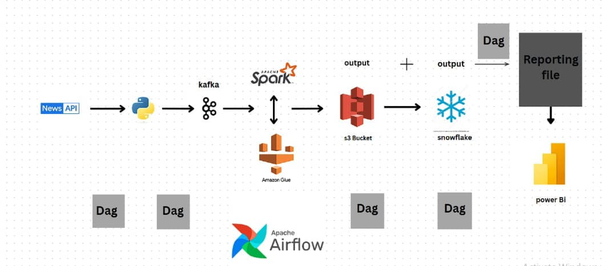

# 📰 Real-Time News Data Pipeline (with Airflow)

This project implements a real-time pipeline that ingests news data from a News API, streams it into Apache Kafka (hosted on EC2) using AWS Lambda, processes the data with AWS Glue (Spark Streaming), stores it in Amazon S3, and loads it into Snowflake. After loading, data from S3 and Snowflake is merged to produce a reporting file back in S3, which is visualized using Power BI. The entire workflow is orchestrated by Apache Airflow.

---

## 🔧 Technologies Used

- News API  
- AWS Lambda  
- Apache Kafka (on EC2)  
- AWS Glue (Streaming)  
- Amazon S3  
- Snowflake  
- Apache Airflow  
- Power BI  

---

## 🔄 Data Flow Overview

```plaintext
[News API]  
     ↓  
[AWS Lambda → Kafka (on EC2)]  
     ↓  
[AWS Glue Streaming Job]  
     ↓  
[S3: processed/news/]  
     ↓  
[Snowflake: Load via COPY INTO]  
     ↓  
[Airflow: Merge Snowflake + S3 data]  
     ↓  
[S3: reporting/final_report.csv]  
     ↓  
[Power BI Dashboard]
```

---

## 📂 Project Files

1. [**`lambda.py`**](lambda.py) — AWS Lambda function that fetches news from the News API and produces it to Kafka (on EC2).

2. [**`glue.py`**](glue.py) — AWS Glue Streaming script that consumes Kafka data and writes structured output to Amazon S3.

3. [**`join.sql`**](join.sql) — SQL script to create Snowflake tables, define an external stage, and load data from S3 using `COPY INTO`.

4. [**`report.py`**](report.py) — Python script that reads data from both Snowflake and S3, merges them using pandas, and writes the report to S3.

5. [**`airflowdag.py`**](airflowdag.py) — The Airflow DAG that orchestrates the full pipeline: Lambda trigger → Glue job → Snowflake load → Merge/report step.
   
---

## ⚙ Configuration Setup
Before running the project, make sure to configure the following components:

🔐 AWS Credentials
Set your AWS credentials so all services (Lambda, Glue, EC2, S3) can authenticate:

AWS_ACCESS_KEY_ID — Your AWS access key

AWS_SECRET_ACCESS_KEY — Your AWS secret key

These can be set as environment variables, in the AWS CLI config, or inside Airflow's .env file if using Docker.

🟦 AWS Lambda (News Ingestion)
Purpose: Fetch news from the News API and publish to Kafka topic

Environment Variables:

NEWS_API_KEY — Your API key for the News API

KAFKA_BROKER — Kafka broker URI (e.g., ec2-xx-xx-xx-xx.compute.amazonaws.com:9092)

Timeout: Set a reasonable Lambda timeout (e.g., 30 seconds)

Permissions: Attach an IAM role allowing access to CloudWatch and basic Lambda execution.

🟧 EC2 Instance (Kafka Broker)
Kafka Setup:

Kafka installed and running on port 9092

EC2 security group must allow inbound traffic on port 9092

advertised.listeners in Kafka config must include the public IP of the EC2 instance.

🟨 AWS Glue (Streaming Job)
Purpose: Consume news messages from Kafka and write structured output to S3

IAM Role: Attach a role with:

Kafka read permissions

S3 write access

Glue Job Settings:

Streaming type job

Checkpointing enabled (use Amazon S3 for checkpoints)

JAR Dependencies: Upload these to an S3 bucket and reference in the job’s --extra-jars:

spark-sql-kafka-0-10_2.12.jar

kafka-clients.jar

hadoop-aws-3.3.x.jar (version depends on Glue version)
Parameter example: --extra-jars s3://your-bucket/jars/spark-sql-kafka-0-10_2.12.jar,s3://your-bucket/jars/kafka-clients.jar,...

🟦 Snowflake
Connection Parameters:

user, password, account, warehouse, database, schema

Stage Setup:

Define external stage pointing to s3://your-bucket/processed/news/

Use COPY INTO to load data into Snowflake table

Schedule: Can be executed via Airflow task or native Snowflake Task (e.g., every 5 minutes).

📊 Power BI
Data Source: Use the reporting CSV file in S3 (s3://your-bucket/reporting/final_report.csv)
or use Snowflake if the final report is pushed back

Refresh Options:

Manual or Scheduled in Power BI Service

Optionally connect via AWS Athena or a REST API gateway if accessing S3 directly.

| Task                          | Triggered By     | Frequency                         |
| ----------------------------- | ---------------- | --------------------------------- |
| **Lambda Trigger**            | Airflow DAG Task | Every 15 minutes                  |
| **Glue Streaming Job**        | Airflow DAG Task | Starts once and runs continuously |
| **Snowflake Data Load**       | Airflow DAG Task | Every 5 minutes                   |
| **Merge & Report Generation** | Airflow DAG Task | After each Snowflake load         |
| **Power BI Visualization**    | Manual/Scheduled | Based on report file availability |

---
## 🔐 Security & Monitoring
IAM Roles with scoped access for:

Lambda → Kafka

Glue → S3

Airflow → Snowflake + S3

CloudWatch for Lambda and Glue logs

Kafka logs monitored via EC2

Airflow logs available in UI or remote store

Power BI dashboard alerts for key KPIs

---

## Architecture Diagram



---

## ✅ Conclusion
This project demonstrates a fully automated real-time data pipeline for news analytics, combining the power of AWS (Lambda, Glue, S3, EC2), Apache Kafka, Snowflake, Apache Airflow, and Power BI. From ingestion to visualization, each stage is seamlessly orchestrated through Airflow, ensuring timely and accurate data processing.

By merging real-time processed news from S3 with structured data in Snowflake, the pipeline generates a unified reporting file that supports deeper insights and business intelligence. The modular design also makes it easy to scale, monitor, and extend — whether for adding more data sources, applying NLP, or integrating with additional reporting tools.

This setup serves as a strong foundation for organizations seeking real-time news analytics, dashboarding, and alerting pipelines using modern cloud-native tools.
